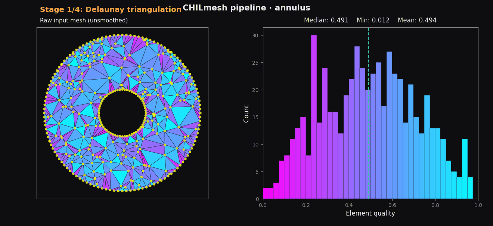
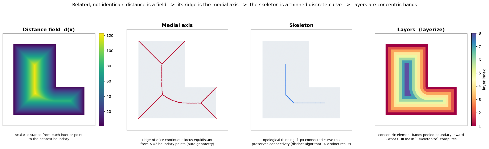

<p align="center">
  
</p>

<h1 align="center">CHILmesh</h1>

<p align="center">
  <strong>Fast 2D mesh processing, smoothing, and analysis for triangular, quadrilateral, and mixed-element meshes. Intended for hydrodynamic domains.</strong>
</p>

<p align="center">
  <strong><a href="https://scholar.google.com/citations?user=IBFSkOcAAAAJ&hl=en">Dominik Mattioli</a><sup>1†</sup>, <a href="https://scholar.google.com/citations?user=mYPzjIwAAAAJ&hl=en">Ethan Kubatko</a><sup>2</sup></strong><br>
  <sup>†</sup>Corresponding author | <sup>1</sup>Unaffiliated | <sup>2</sup>Ohio State University (<a href="https://ceg.osu.edu/computational-hydrodynamics-and-informatics-laboratory"></a>)
</p>

<p align="center">
  <a href="https://pypi.org/project/chilmesh/"></a>
  <a href="https://www.python.org/downloads/"></a>
  <a href="https://github.com/domattioli/CHILmesh/actions/workflows/python-package.yml"></a>
  <a href="https://github.com/domattioli/CHILmesh/issues"></a>
  <a href="https://doi.org/10.5281/zenodo.20263854"></a>
  <a href="https://github.com/domattioli/CHILmesh/blob/main/LICENSE"></a>
</p>

> **MATLAB users:** This Python library is the actively-developed successor to the original MATLAB codebase. The original (no longer maintained) is at [`src/@CHILmesh/CHILmesh.m`](src/@CHILmesh/CHILmesh.m) and on <a href="https://www.mathworks.com/matlabcentral/fileexchange/135632-chilmesh"></a>

---

## Table of Contents

- [Status & roadmap](#status--roadmap)
- [Why CHILmesh](#why-chilmesh)
- [Installation](#installation)
- [Quick start](#quick-start)
- [Performance](#performance)
- [Examples](#examples)
- [Citation](#citation)
- [Contributing](#contributing) · [Documentation](#documentation) · [License](#license)

## Status & Roadmap

**Current status (June 2026): Stable and actively-maintained.** C++ half-edge backend (up to ~15× faster on full init); bit-identical output verified; 36 cross-backend equivalence tests; fort.14 + .2dm I/O; mixed-element support.

- **Now:** Pre-built binary wheels (cibuildwheel, manylinux/macOS/Windows); Rust skeletonization completion ([#163](https://github.com/domattioli/CHILmesh/issues/163)); Full mutation suite ([#94](https://github.com/domattioli/CHILmesh/issues/94)).
- **Next:** performance optimization; parallelization; conda-forge packaging; mkdocs API site; native `.chil` file format
- **Future:** formal integration within a unified ecoystem including <a href="https://github.com/domattioli/ADMESH"></a> and <a href="https://github.com/domattioli/QuADMESH"></a>

---

## Why CHILmesh

**The stable backbone for hydrodynamic mesh generation & tooling.**

- **Pythonic API** — `from chilmesh import Mesh`; backwards-compatible `CHILmesh` alias preserved.
- **C++ acceleration, bit-identical output** — half-edge extension is **up to ~15× faster than pure Python** on full init (8.6× on the 272k-element ENPAC mesh below), verified bit-for-bit by [36 cross-backend equivalence tests](tests/test_backend_equivalence.py).
- **One interface for all topologies** — triangles, quadrilaterals, and mixed meshes share the same call surface.
- **Stable v1.x API** — downstream projects can pin `chilmesh>=1.0,<2`.

---

## Installation

```bash
pip install chilmesh                        # PyPI
uv pip install chilmesh                     # uv
conda install -c conda-forge chilmesh       # conda-forge (pending)
pip install -e .                            # from source
```

---

## Quick Start

```python
from chilmesh import Mesh

mesh = Mesh.read_from_fort14("ocean.14")
mesh.smooth_mesh(method="fem", acknowledge_change=True)
quality, angles, stats = mesh.elem_quality()
mesh.plot_quality()
```

The legacy `chilmesh.CHILmesh` import is preserved for backward compatibility. Built-in fixtures live at `chilmesh.examples.{annulus, donut, block_o, structured}()`. See [`examples/`](examples/) for runnable scripts.

---

## Features

- **Fast** — C++ backend full-inits the 531,680-element ENPAC2003 mesh in ~1.4 s — 8.6× over pure Python (up to ~15× on smaller meshes)
- **Mixed-element** — triangles, quads, and mixed meshes share one API
- **Smoothing** — Balendran direct FEM, Zhou-Shimada angle-based, and ADMESH Spring-Based Truss
- **Analysis** — element quality, interior angles, layer-based decomposition (layerize)
- **I/O** — [ADCIRC](https://adcirc.org/) `.fort.14` and [SMS Aquaveo](https://www.aquaveo.com/sms) `.2dm` read/write
- **Spatial queries** — point-in-element, k-nearest vertices, radius search at O(log n)
- **Mesh alterations** — advancing-front element addition (`add_advancing_front_element`), coordinate moves; full mutation suite tracked in [#94](https://github.com/domattioli/CHILmesh/issues/94)
- **Valence integration** — `from_admesh_domain()` adapter

### Performance

Reference workload: **EasternPacific_ENPAC2003** — 272,913 vertices · 531,680 elements · 75 layers, from the [Valence](https://github.com/domattioli/Valence) registry. Medians of 3 runs, single machine, chilmesh 1.2.2.

| Stage | MATLAB (Octave) ‡ | Python | C++ | Rust |
|---|---:|---:|---:|---:|
| Fast init (adj, no layerize) | 2.738 s | 6.454 s | 0.769 s | tbd |
| Layerize only | 12.771 s | 5.814 s | 0.669 s | tbd |
| Full init (adj + layerize) | 16.677 s | 12.300 s | 1.438 s | tbd |
| Quality (signed area) | 75 ms | 51 ms | 7 ms | tbd |

Like-for-like: every backend runs the same operation on the same in-memory arrays. No fort.14 parse, signed-area quality. All resolve `n_layers = 75`; Python↔C++ layers are bit-identical ([`test_backend_equivalence.py`](tests/test_backend_equivalence.py)).

- **C++ leads every stage** — full init 8.6× over Python, 11.6× over Octave.
- **Octave builds adjacency 2.4× faster than Python** — `sparse()`-accumulated, in compiled built-ins.
- **Python layerizes 2.2× faster than Octave** — ~26% ahead on full init overall.
- **Rust pending** (`tbd`) — skeletonization incomplete ([#163](https://github.com/domattioli/CHILmesh/issues/163)).

‡ Octave 8.4, interpreter. Times are in-memory compute only — fort.14 parse and rendering excluded. Machine-dependent. Full method: [`docs/BENCHMARK.md`](docs/BENCHMARK.md).

<p align="center">
  
  <br>
  <sub><em><strong>Figure 1.</strong> Scale demo on EasternPacific_ENPAC2003 (272,913 vertices · 531,680 elements). <code>plot_quality()</code> renders per-element skew quality; <code>plot_quality_histogram()</code> emits the matched-colormap distribution beneath. Reproduce: <code>python scripts/generate_enpac_showcase.py</code>.</em></sub>
</p>

Full pipeline cost (parse · adjacency · layerize · spatial-index · quality · render — render dominates), the cross-backend layer-parity catalog (557 → 273k vertices), and mesh-quality metrics: [`docs/BENCHMARK.md`](docs/BENCHMARK.md). Layerization is distinct from medial axis / skeleton / distance — [`docs/CONCEPTS.md`](docs/CONCEPTS.md):

<p align="center">
  
  <br>
  <sub><em><strong>Figure 2.</strong> Related, not identical — distance is a scalar <em>field</em>; its ridge is the <em>medial axis</em>; the <em>skeleton</em> is a thinned discrete curve; <em>layers</em> are concentric element bands (what CHILmesh layerizes). Full write-up: <a href="docs/CONCEPTS.md">docs/CONCEPTS.md</a>. Reproduce: <code>python scripts/illustrate_mesh_concepts.py</code>.</em></sub>
</p>

### Smoothing

Three algorithms — each preserves boundary nodes, leaves topology unchanged, and accepts mixed-element meshes.

| Algorithm | API call | Style | Best for |
|---|---|---|---|
| **[Balendran direct FEM](https://www.researchgate.net/publication/221561841_A_Direct_Smoothing_Method_for_Surface_Meshes)** | `smooth_mesh(method='fem')` | One-shot sparse solve | General-purpose default; stable on tri/quad/mixed |
| **[Zhou-Shimada angle-based](https://www.researchgate.net/publication/221561796_An_Angle-Based_Approach_to_Two-Dimensional_Mesh_Smoothing/citations)** | `smooth_mesh(method='angle-based')` | Iterative, angle-maximising | Difficult mixed meshes where FEM stalls |
| **[ADMESH Spring-Based Truss](https://doi.org/10.1007/s10236-012-0574-0)** | `smooth_mesh(method='sdf', sdf=...)` | Spring/force relaxation against SDF | Quality gains with SDF-respecting boundary nodes (triangle-only) |

### Backends

`pip install chilmesh` gives you the pure-Python implementation — zero compiled dependencies, runs everywhere, and is the canonical reference every other backend is validated against. The C++ extension is the high-performance opt-in: same algorithms, bit-identical output, up to ~15× faster on full init.

| Language | Role | How to get it |
|---|---|---|
| **Python** | Reference implementation — the default | `pip install chilmesh` |
| **C++** | High-performance backend (half-edge) — bit-identical output | `pip install ./src/chilmesh_cpp` (build from source) |
| Rust | Experimental (quad-edge); skeletonization is incomplete — see [#163](https://github.com/domattioli/CHILmesh/issues/163) | source build, not recommended yet |
| MATLAB | Original 2017 implementation, archived & unmaintained | [`src/@CHILmesh/CHILmesh.m`](src/@CHILmesh/CHILmesh.m) |

```python
import chilmesh

chilmesh.backend_info()
# {'available': ['cpp', 'python'],
#  'selected': 'cpp',
#  'versions': {'cpp': '0.6.0.dev0', 'python': '1.2.2'}}
```

Force a specific backend with `CHILMESH_BACKEND` (`python` or `cpp`). When unset, the fastest available is picked. Pre-built binary wheels (`manylinux` / `macOS` / `Windows`) via `cibuildwheel` are planned — see [`docs/`](docs/) for build-from-source instructions.

### Engine

CHILmesh is a **graph over the mesh** — seven adjacency tables (built once) back O(1) edge lookup, O(n log n) adjacency build, O(n) layerize, and O(log n) spatial queries. The C++ half-edge backend reproduces them bit-for-bit. Full table + complexities: [`docs/ARCHITECTURE.md`](docs/ARCHITECTURE.md).

### Examples

```bash
python examples/01_quickstart.py        # load, stats, plot
python examples/02_fort14_roundtrip.py  # fort.14 read/write
python examples/03_smoothing.py         # angle-based smoother
python examples/04_spatial_queries.py   # find_element, radius search, k-nearest
```

### CLI

```bash
chilmesh info mesh.fort.14                                      # stats
chilmesh convert mesh.2dm mesh.fort.14                         # format conversion
chilmesh smooth mesh.fort.14 -o out.fort.14 --method fem       # smooth in-place
chilmesh plot mesh.fort.14 -o mesh.png --quality               # render
```

Also available as `python -m chilmesh`. Each subcommand has `--help`.

---


## Documentation

- [`docs/API.md`](docs/API.md) — full API reference
- [`docs/BENCHMARK.md`](docs/BENCHMARK.md) — benchmark methodology and raw data
- [`docs/CONCEPTS.md`](docs/CONCEPTS.md) — distance vs medial axis vs skeleton vs layers (definitions, algorithms, math, synonyms)
- [`tests/TESTING.md`](tests/TESTING.md) — test guide (pytest markers, local commands)
- [`examples/`](examples/) — runnable scripts (quickstart, fort.14 round-trip, smoothing, spatial queries)

---

## Citation

CHILmesh originated in MATLAB as the data structure backing a skeletonization-driven indirect tri-to-quad conversion heuristic (Mattioli, OSU MSc Thesis, 2017) <a href="https://github.com/user-attachments/files/19724263/QuADMESH-Thesis.pdf">
    </a>
```bibtex
@software{mattioli_chilmesh,
  author    = {Mattioli, Dominik O. and Kubatko, Ethan J.},
  title     = {{CHILmesh}: a fast 2D mesh library for triangular,
               quadrilateral, and mixed-element grids},
  year      = {2026},
  publisher = {Zenodo},
  version   = {1.2.2},
  doi       = {10.5281/zenodo.20263854},
  url       = {https://github.com/domattioli/CHILmesh}
}
```

**Thesis source (Mattioli, 2017).** [Read thesis (PDF)](https://github.com/user-attachments/files/19727573/QuADMESH__Thesis_Doc.pdf)

```bibtex
@mastersthesis{mattioli2017quadmesh,
  author = {Mattioli, Dominik O.},
  title  = {{QuADMESH+}: A Quadrangular ADvanced Mesh Generator
            for Hydrodynamic Models},
  school = {The Ohio State University},
  year   = {2017},
  url    = {http://rave.ohiolink.edu/etdc/view?acc_num=osu1500627779532088}
}
```

---

## Contributing

Issues and PRs welcome at [github.com/domattioli/CHILmesh](https://github.com/domattioli/CHILmesh). Run `pytest -v` before opening a PR — see [`tests/TESTING.md`](tests/TESTING.md).

---

## License

**Noncommercial / research use only.** Licensed under the PolyForm Noncommercial License 1.0.0 **with an additional No-AI/ML-training restriction** — see [LICENSE](LICENSE) and [.claude/AI-USAGE.md](.claude/AI-USAGE.md). No commercial use and no use as AI/ML training data without a separate written license. Commercial or AI-training licenses: [https://github.com/domattioli](https://github.com/domattioli)
