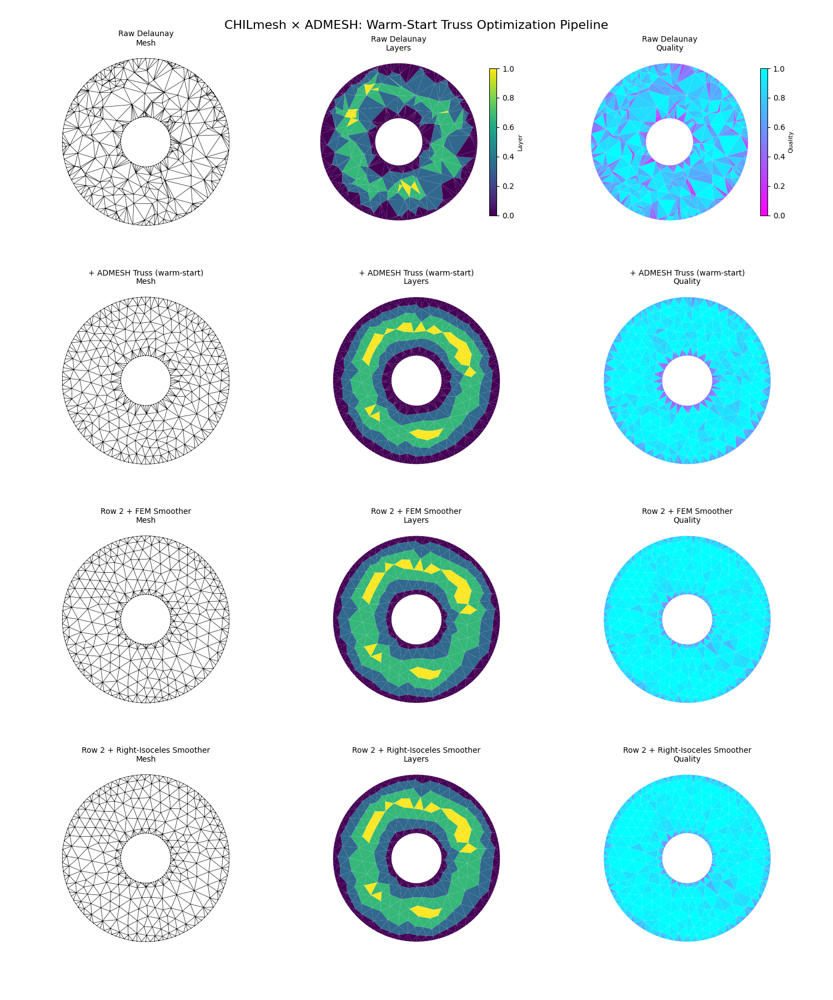

<h1 align="center">
  CHILmesh
</h1>

<p align="center">
  <strong>Fast 2D mesh generation and analysis for triangular, quadrilateral, and mixed-element meshes.</strong>
</p>

<p align="center">
  <strong><a href="https://scholar.google.com/citations?user=IBFSkOcAAAAJ&hl=en">Dominik Mattioli</a><sup>1†</sup>, <a href="https://scholar.google.com/citations?user=mYPzjIwAAAAJ&hl=en">Ethan Kubatko</a><sup>2</sup></strong><br>
  <sup>†</sup>Corresponding author | <sup>1</sup>Penn State University | <sup>2</sup>Ohio State University (CHIL)
</p>

<p align="center">
  <a href="https://ceg.osu.edu/computational-hydrodynamics-and-informatics-laboratory"></a>
  <a href="https://github.com/domattioli/ADMESH"></a>
  <a href="https://pypi.org/project/chilmesh/"></a>
  <a href="https://github.com/domattioli/CHILmesh/actions/workflows/test.yml"></a>
  <a href="https://github.com/domattioli/CHILmesh/blob/main/LICENSE"></a>
</p>

---

## Quick Start

Generate, smooth, and analyze 2D meshes in seconds:

```python
import chilmesh
import matplotlib.pyplot as plt

# Load example mesh
mesh = chilmesh.examples.annulus()

# Smooth with FEM formulation
mesh.smooth_mesh(method='fem', acknowledge_change=True)

# Analyze quality
quality, angles, stats = mesh.elem_quality()
mesh.plot_quality()
plt.show()
```

### Visual Comparison: Four Pipelines

See how different mesh generation and smoothing approaches compare on the same domain:



**Row 1:** Random Delaunay triangulation (raw, unsmoothed)
**Row 2:** Row 1 + CHILmesh FEM smoother (quality improvement via relaxation)
**Row 3:** Fresh ADMESH triangulation with both-boundary size gradation (small near rings, large in middle)
**Row 4:** Row 3 + ADMESH right-isoceles smoother (preparation for tri-to-quad fusion)

Columns: **left** = mesh wireframe · **center** = skeletonization layers (parula) · **right** = element quality (cool)

#### How to regenerate this figure

```bash
python generate_4row_admesh.py
```

The script lives at the repo root and writes `tests/output/annulus_quickstart.png`. It enforces seven fail-loud assertions (V1–V7) before saving — see [`specs/004-fix-readme-viz/`](specs/004-fix-readme-viz/) for the full design contract, or [`specs/004-fix-readme-viz/quickstart.md`](specs/004-fix-readme-viz/quickstart.md) for the verification checklist.

---

## Features

- **Fast**: 937× speedup vs v0.1.1 through optimized data structures
- **Mixed-Element**: Triangles, quads, and mixed meshes with unified API
- **Smoothing**: FEM and geometric smoothing for quality improvement
- **Analysis**: Element quality metrics, interior angles, layer-based skeletonization
- **I/O**: Read/write ADCIRC `.fort.14` and SMS `.2dm` formats
- **Catalog**: ADMESH-Domains integration via `from_admesh_domain()` adapter

---

## Installation

From PyPI:
```bash
pip install chilmesh
```

From source:
```bash
git clone https://github.com/domattioli/CHILmesh && cd CHILmesh
pip install -e .
```

---

## Performance (v0.2.0)

**937× faster** than v0.1.1 through systematic optimization.

| Operation | v0.1.1 | v0.2.0 | Speedup |
|-----------|--------|--------|---------|
| Fast init (52.7k verts) | 3,200s | 3.9s | **822×** |
| Full init (with layers) | 5,400s | 7.7s | **701×** |
| Quality analysis | 4,800s | 6.6s | **727×** |
| **Total workflow** | 13,400s | 14.3s | **937×** |

See [BENCHMARK.md](BENCHMARK.md) for detailed methodology.

---

## API Overview

```python
import chilmesh

# Load examples or from file
mesh = chilmesh.examples.annulus()
mesh = chilmesh.CHILmesh.read_from_fort14('mesh.14')
mesh = chilmesh.CHILmesh.read_from_2dm('mesh.2dm')

# Smooth mesh
mesh.smooth_mesh(method='fem', acknowledge_change=True)

# Analyze
quality, angles, stats = mesh.elem_quality()
interior_angles = mesh.interior_angles()

# Visualize
mesh.plot()
mesh.plot_quality()
mesh.plot_layer()

# Layer structure (skeletonization)
layers = mesh.layers  # {'OE': [...], 'IE': [...], 'OV': [...], 'IV': [...]}

# Access topology
edges = mesh.boundary_edges()
boundary_nodes = mesh.boundary_node_indices()
```

---

## Mesh Element Types

- **Triangles**: 3-vertex elements
- **Quads**: 4-vertex elements  
- **Mixed**: Both types in same mesh (triangles padded to 4 columns)

---

## Downstream Projects

[**MADMESHR**](https://github.com/domattioli/MADMESHR) — Advancing-front mesh adaptation built on CHILmesh  
[**ADMESH**](https://github.com/domattioli/ADMESH) — Optimized mesh generation and smoothing  
[**ADMESH-Domains**](https://github.com/domattioli/ADMESH-Domains) — Mesh catalog for hydrodynamic applications  

---

## Citation

```bibtex
@mastersthesis{mattioli2017quadmesh,
  author       = {Mattioli, Dominik O.},
  title        = {{QuADMESH+}: A Quadrangular ADvanced Mesh Generator for Hydrodynamic Models},
  school       = {The Ohio State University},
  year         = {2017},
  url          = {http://rave.ohiolink.edu/etdc/view?acc_num=osu1500627779532088}
}
```

[Read thesis PDF](https://github.com/user-attachments/files/19727573/QuADMESH__Thesis_Doc.pdf)

---

## References

- [FEM Smoother (Zhou & Shimada, 2000)](https://api.semanticscholar.org/CorpusID:34335417)
- [Angle-Based Smoothing](https://www.andrew.cmu.edu/user/shimada/papers/00-imr-zhou.pdf)
- [ADMESH Paper](https://doi.org/10.1007/s10236-012-0574-0)
- Original MATLAB implementation funded by [Aquaveo](https://aquaveo.com/)

---

## License

MIT License — See [LICENSE](LICENSE) for details.
