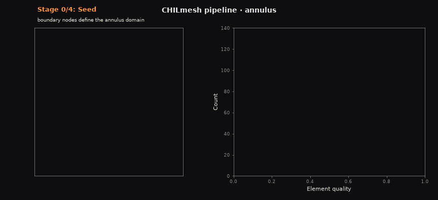
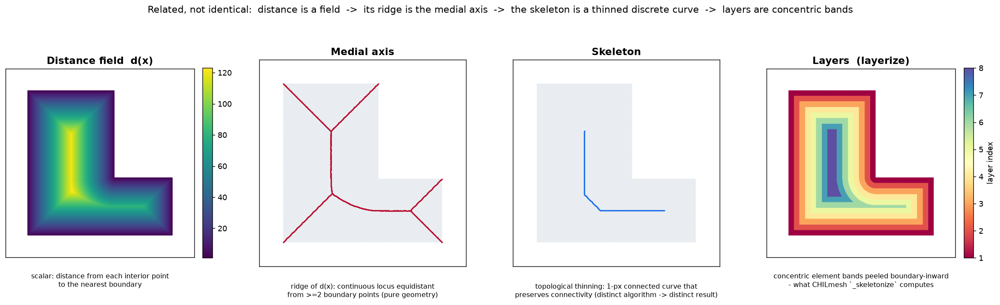

<p align="center">
  
</p>

<h1 align="center">CHILmesh</h1>

<p align="center">
  <strong>2D mesh I/O, layer peel, smoothing, and quality analysis for triangular, quadrilateral, and mixed-element hydrodynamic meshes; C++ backend 8.6× to 14.7× faster than Python on full init.</strong>
</p>

<p align="center">
  <strong><a href="https://scholar.google.com/citations?user=IBFSkOcAAAAJ&hl=en">Dominik Mattioli</a><sup>1†</sup>, <a href="https://scholar.google.com/citations?user=mYPzjIwAAAAJ&hl=en">Ethan Kubatko</a><sup>2</sup></strong><br>
  <sup>†</sup>Corresponding author | <sup>1</sup>Unaffiliated | <sup>2</sup>Ohio State University (<a href="https://ceg.osu.edu/computational-hydrodynamics-and-informatics-laboratory"></a>)
</p>

<p align="center">
  <a href="https://pypi.org/project/chilmesh/">
    
  </a>
  <a href="https://www.python.org/downloads/">
    
  </a>
  <a href="https://github.com/domattioli/CHILmesh/actions/workflows/python-package.yml">
    
  </a>
  <a href="https://github.com/domattioli/CHILmesh/issues">
    
  </a>
  <a href="https://doi.org/10.5281/zenodo.21362772"></a>
  <a href="https://github.com/domattioli/CHILmesh/blob/main/LICENSE">
    
  </a>
</p>


> **MATLAB users.** This Python library is the maintained successor to the original MATLAB codebase. The original, no longer maintained, is at [`src/@CHILmesh/CHILmesh.m`](src/@CHILmesh/CHILmesh.m) and on <a href="https://www.mathworks.com/matlabcentral/fileexchange/135632-chilmesh"></a>. The Python API is reachable from MATLAB through the `py.` bridge after `pip install chilmesh`, for example `py.chilmesh.Mesh.read_from_fort14('ocean.14')`; no MEX build is needed.

---

## Table of Contents

1. [Status & Roadmap](#1-status--roadmap)
2. [Why CHILmesh](#2-why-chilmesh)
3. [Installation](#3-installation)
4. [Quick start](#4-quick-start)
5. [Capabilities](#5-capabilities)
6. [Performance](#6-performance)
7. [Backends](#7-backends)
8. [Examples and CLI](#8-examples-and-cli)
9. [Limitations](#9-limitations)
10. [Documentation](#10-documentation)
11. [Citation](#11-citation)
12. [Contributing](#12-contributing)
13. [License](#13-license)

## 1. Status & Roadmap

**Shipped: chilmesh 1.4.1 (PyPI, 2026-07-14), stable v1.x API.** Downstream projects can pin `chilmesh>=1.0,<2`. The release covers fort.14, fort.13, fort.15, .2dm and Gmsh .msh I/O; triangular, quadrilateral and mixed-element meshes; concentric layer peel; three smoothers; a 13-operation mutation API ([#94](https://github.com/domattioli/CHILmesh/issues/94)); an optional C++ half-edge backend with bit-identical output.

- **Now:** pre-built C++ binary wheels on PyPI, so `pip install chilmesh[cpp]` needs no toolchain ([#256](https://github.com/domattioli/CHILmesh/issues/256)).
- **Next:** a native `.chil` container format ([#201](https://github.com/domattioli/CHILmesh/issues/201)); a documentation site.
- **Later:** one ecosystem with <a href="https://github.com/domattioli/ADMESH"></a> and <a href="https://github.com/domattioli/QuADMESH"></a>.

<div align="right"><a href="#chilmesh"><sub>^ Back to top</sub></a></div>

## 2. Why CHILmesh

CHILmesh began in 2015-2017 at The Ohio State University as the data structure behind QuADMESH+, a layer-peel-driven indirect triangle-to-quadrilateral conversion heuristic for hydrodynamic models (Mattioli, MSc thesis, 2017; see [Citation](#11-citation)). The mesh generator needed three things no single tool provided: one adjacency model that treats triangles, quadrilaterals and mixed meshes identically; a concentric layer decomposition of the domain, from the boundary inward; and the ADCIRC and SMS file formats that coastal-ocean models read.

The Python library keeps that scope and adds the engineering the MATLAB code lacked. Seven adjacency tables are built once ([`docs/ARCHITECTURE.md`](docs/ARCHITECTURE.md)), giving O(1) edge lookup, O(n) layer peel and O(log n) spatial queries. Every algorithm has one reference implementation in Python. The C++ backend reproduces it bit-for-bit, verified by 76 parametrized equivalence cases in [`tests/test_backend_equivalence.py`](tests/test_backend_equivalence.py). Terminology is fixed in [`docs/CONCEPTS.md`](docs/CONCEPTS.md): a layer is a concentric band of elements, distinct from a distance field, a medial axis or a skeleton ("vertex", "node" and "point" are interchangeable throughout this documentation).

<div align="right"><a href="#chilmesh"><sub>^ Back to top</sub></a></div>

## 3. Installation

```bash
pip install chilmesh          # PyPI, pure Python
uv pip install chilmesh       # uv
pip install -e ".[dev]"       # from source, with the test suite
```

The PyPI wheel is pure Python; it ships no compiled extension, and `chilmesh.backend_info()` reports `available: ['python']`. The C++ speedups in [Performance](#6-performance) require a source build with a C++ toolchain and CMake:

```bash
pip install ./src/chilmesh_cpp    # or: bash scripts/build_cpp.sh
```

Binary wheels are tracked in [#256](https://github.com/domattioli/CHILmesh/issues/256). Python 3.10 or newer is required.

<div align="right"><a href="#chilmesh"><sub>^ Back to top</sub></a></div>

## 4. Quick start

```python
import numpy as np
from chilmesh import Mesh

mesh = Mesh.read_from_fort14("ocean.14")          # ADCIRC grid, boundaries preserved
mesh.smooth_mesh(method="fem", acknowledge_change=True)
quality, angles, stats = mesh.elem_quality()      # per-element skew quality
elem = mesh.find_element(np.array([-75.2, 35.1]))  # O(log n) point location
mesh.write_to_fort14("ocean_smoothed.14")
```

`chilmesh.CHILmesh` remains as an alias of `Mesh`. Four fixtures ship with the package: `chilmesh.examples.{annulus, donut, block_o, structured}()`.

<div align="right"><a href="#chilmesh"><sub>^ Back to top</sub></a></div>

## 5. Capabilities

| Area | What ships | Entry points |
|---|---|---|
| File formats | ADCIRC fort.14 (lossless round trip, boundary records kept), fort.13 nodal attributes, fort.15 control file; SMS Aquaveo .2dm; Gmsh .msh 2.2 and 4.1; header-only `summary()` for fort.14, .2dm, fort.13, fort.15, .msh, .npy and .npz without loading the mesh | `Mesh.read_from_fort14`, `read_fort13`, `read_fort15`, `Mesh.read_from_2dm`, `Mesh.read_from_msh`, `chilmesh.summary` |
| Topology | Triangular, quadrilateral and mixed meshes on one API; seven adjacency tables; concentric layer peel with per-layer `OE`, `IE`, `OV`, `IV` and boundary-edge IDs | `Mesh.peel_layers`, `mesh.layers` |
| Quality | Skew quality and interior angles per element; per-edge Courant number and a CFL gate from depths and a time step | `Mesh.elem_quality`, `courant_number`, `cfl_gate` |
| Smoothing | Balendran direct FEM; Zhou-Shimada angle-based; ADMESH spring-based truss against a signed distance function; plain Laplacian. Boundary nodes fixed, topology unchanged, mixed meshes accepted | `Mesh.smooth_mesh(method=...)`, `Mesh.smooth` |
| Mutation | 13 topology operations: split triangle, split edge, split boundary edge, swap edge, merge elements, remove vertex, collapse edge, insert vertex, move boundary node, split triangles, topological smoothing, local re-peel, layer diff | `chilmesh.mutations` |
| Boundary editing | Advancing-front element addition, boundary-loop removal, pinch-point detection in narrow channels | `Mesh.add_advancing_front_element`, `Mesh.remove_boundary_loop`, `Mesh.pinch_points` |
| Spatial queries | Point-in-element, radius search, k-nearest vertices, all O(log n) after a one-time index | `Mesh.find_element`, `Mesh.find_elements_in_radius`, `Mesh.nearest_vertices` |
| Geometry | Haversine distance, convex hull, Hausdorff distance, antimeridian-aware bounding boxes | `chilmesh.geometry` |
| Interop | ADMESH domain adapter and truss warm start; renumbering-tolerant node matching between two meshes with nodal-field deltas | `Mesh.from_admesh_domain`, `chilmesh.admesh_warmstart`, `match_nodes` |
| Plotting | Mesh, per-element quality map, matched-colormap quality histogram, layer paths | `Mesh.plot`, `Mesh.plot_quality`, `Mesh.plot_quality_histogram` |

<div align="right"><a href="#chilmesh"><sub>^ Back to top</sub></a></div>

## 6. Performance

**The C++ backend full-initializes the 531,680-element ENPAC2003 mesh in 1.44 s against 12.30 s in Python, an 8.6× speedup; on the 98,365-element WNAT_Hagen mesh the ratio is 14.7× (1.65 s → 0.112 s).** Reference workload: EasternPacific_ENPAC2003, 272,913 vertices, 531,680 elements, 75 layers, from the [Valence](https://github.com/domattioli/Valence) registry. Medians of 3 runs on one machine at chilmesh 1.2.2; the algorithms have not changed since, and a 1.4.1 rerun on a second machine gave Python 11.89 s and C++ 0.803 s for full init.

| Stage | MATLAB (Octave 8.4) | Python | C++ | Rust |
|---|---:|---:|---:|---:|
| Fast init (adjacency, no peel) | 2.738 s | 6.454 s | 0.769 s | not exposed |
| Peel only | 12.771 s | 5.814 s | 0.669 s | not exposed |
| Full init (adjacency + peel) | 16.677 s | 12.300 s | 1.438 s | 11.98 s † |
| Quality (signed area) | 75 ms | 51 ms | 7 ms | 2 ms † |

Every backend runs the same operation on the same in-memory arrays; fort.14 parsing and rendering are excluded. All four resolve `n_layers = 75`, and Python and C++ layers are bit-identical. Octave builds adjacency 2.4× faster than Python through `sparse()` accumulation, and Python peels 2.2× faster than Octave. † Rust measured at chilmesh 1.4.1 on the second machine, where the same-machine controls were Python 11.89 s and C++ 0.803 s. Method, raw data and a 557-to-273k-vertex layer-parity catalog: [`docs/BENCHMARK.md`](docs/BENCHMARK.md).

<p align="center">
  
  <br>
  <sub><em><strong>Figure 1.</strong> EasternPacific_ENPAC2003 (272,913 vertices, 531,680 elements). <code>plot_quality()</code> renders per-element skew quality; <code>plot_quality_histogram()</code> draws the matched-colormap distribution beneath. Reproduce with <code>python scripts/generate_enpac_showcase.py</code>.</em></sub>
</p>

<p align="center">
  
  <br>
  <sub><em><strong>Figure 2.</strong> Distance is a scalar field; its ridge is the medial axis; the skeleton is a thinned discrete curve; layers are the concentric element bands CHILmesh peels. Definitions and algorithms: <a href="docs/CONCEPTS.md">docs/CONCEPTS.md</a>. Reproduce with <code>python scripts/illustrate_mesh_concepts.py</code>.</em></sub>
</p>

<div align="right"><a href="#chilmesh"><sub>^ Back to top</sub></a></div>

## 7. Backends

| Backend | Role | Status | How to get it |
|---|---|---|---|
| Python | Reference implementation; every other backend is validated against it | Default | `pip install chilmesh` |
| C++ (half-edge) | Accelerator, bit-identical output, 8.6× to 14.7× on full init | Recommended build | `pip install ./src/chilmesh_cpp` |
| Rust (quad-edge) | Output-equivalent on all four fixtures (`rust-equivalence` CI); measured 2× to 5× slower than C++ on full init | Frozen, not developed further ([`docs/RUST_EVALUATION.md`](docs/RUST_EVALUATION.md)) | `maturin build` in `src/chilmesh_core`, not recommended |
| MATLAB | Original 2017 implementation | Archived | [`src/@CHILmesh/CHILmesh.m`](src/@CHILmesh/CHILmesh.m) |

With `CHILMESH_BACKEND` unset, CHILmesh selects the fastest available backend in the order C++, Rust, Python. Force one with `CHILMESH_BACKEND=python|cpp|rust` and inspect the choice with `chilmesh.backend_info()`:

```python
import chilmesh
chilmesh.backend_info()
# After a source build of the C++ extension:
# {'available': ['cpp', 'python'], 'selected': 'cpp',
#  'versions': {'cpp': '0.6.0.dev0', 'python': '1.4.1'}}
```

Parity is gated in CI: the `cpp-equivalence` and `rust-equivalence` jobs build each extension and run the equivalence suite on every push.

<div align="right"><a href="#chilmesh"><sub>^ Back to top</sub></a></div>

## 8. Examples and CLI

```bash
python examples/01_quickstart.py        # load, stats, plot
python examples/02_fort14_roundtrip.py  # fort.14 read and write
python examples/03_smoothing.py         # angle-based smoother
python examples/04_spatial_queries.py   # find_element, radius search, k-nearest
```

```bash
chilmesh info mesh.fort.14                                   # vertex, element and layer counts
chilmesh summary mesh.fort.14                                # header-only metadata, no full parse
chilmesh convert mesh.2dm mesh.fort.14                       # format conversion
chilmesh smooth mesh.fort.14 -o out.fort.14 --method fem     # smooth and write
chilmesh plot mesh.fort.14 -o mesh.png --quality             # render
```

`python -m chilmesh` is equivalent; every subcommand takes `--help`.

<div align="right"><a href="#chilmesh"><sub>^ Back to top</sub></a></div>

## 9. Limitations

- **Two-dimensional only.** Vertices carry a z value for bathymetry, but all topology, quality and smoothing operate in the plane. Surface and volume meshes are out of scope.
- **The PyPI wheel is pure Python.** The compiled backends need a source build until [#256](https://github.com/domattioli/CHILmesh/issues/256) lands, so a plain install runs at the Python column of the table above.
- **Rust is frozen.** It is kept output-equivalent but receives no new work, exposes no separate fast-init or peel timing, and earns no performance niche over C++.
- **Smoothing does not change topology.** Quality gains come from vertex moves only; the ADMESH truss smoother is triangle-only. Topological repair is the separate mutation API.
- **The .2dm writer drops boundary records.** `save('.2dm')` then `read_from_2dm` is lossless for geometry and topology but not for fort.14 boundary metadata ([#228](https://github.com/domattioli/CHILmesh/issues/228)).
- **Benchmarks are single-machine medians of three runs.** Absolute times are machine-dependent; ratios between backends are the reproducible quantity.
- **The layer peel is not a medial axis, skeleton or distance transform.** Users needing those should see [`docs/CONCEPTS.md`](docs/CONCEPTS.md) for what the layers do and do not represent.

<div align="right"><a href="#chilmesh"><sub>^ Back to top</sub></a></div>

## 10. Documentation

- [`docs/API.md`](docs/API.md): API reference
- [`docs/ARCHITECTURE.md`](docs/ARCHITECTURE.md): adjacency tables, complexities and the layerization boundary
- [`docs/BENCHMARK.md`](docs/BENCHMARK.md): benchmark method and raw data
- [`docs/CONCEPTS.md`](docs/CONCEPTS.md): distance field, medial axis, skeleton and layers
- [`docs/RUST_EVALUATION.md`](docs/RUST_EVALUATION.md): the measured case for freezing the Rust backend
- [`tests/TESTING.md`](tests/TESTING.md): pytest markers, backend setup, parity tests
- [`examples/`](examples/): runnable scripts

<div align="right"><a href="#chilmesh"><sub>^ Back to top</sub></a></div>

## 11. Citation

### Software

<p align="center">
  <a href="https://doi.org/10.5281/zenodo.21362772"></a>
</p>

```bibtex
@software{mattioli_chilmesh,
  author    = {Mattioli, Dominik O. and Kubatko, Ethan J.},
  title     = {{CHILmesh}: a fast 2D mesh library for triangular,
               quadrilateral, and mixed-element grids},
  year      = {2026},
  publisher = {Zenodo},
  version   = {1.4.1},
  doi       = {10.5281/zenodo.21362772},
  url       = {https://github.com/domattioli/CHILmesh}
}
```

### Original method

<p align="center">
  <a href="https://github.com/user-attachments/files/19727573/QuADMESH__Thesis_Doc.pdf"></a>
</p>

```bibtex
@mastersthesis{mattioli2017quadmesh,
  author = {Mattioli, Dominik O.},
  title  = {{QuADMESH+}: A Quadrangular ADvanced Mesh Generator
            for Hydrodynamic Models},
  school = {The Ohio State University},
  year   = {2017},
  url    = {http://rave.ohiolink.edu/etdc/view?acc_num=osu1500627779532088}
}
```

CHILmesh is a by-product of a project funded by Aquaveo at The Ohio State University in 2015-2017.

<div align="right"><a href="#chilmesh"><sub>^ Back to top</sub></a></div>

## 12. Contributing

Issues and pull requests at [github.com/domattioli/CHILmesh](https://github.com/domattioli/CHILmesh). Run `pytest -v` before opening a PR; markers and backend setup are in [`tests/TESTING.md`](tests/TESTING.md).

<div align="right"><a href="#chilmesh"><sub>^ Back to top</sub></a></div>

## 13. License

**Noncommercial and research use only.** PolyForm Noncommercial License 1.0.0 with an additional No-AI/ML-training restriction; see [LICENSE](LICENSE) and [docs/AI-USAGE.md](docs/AI-USAGE.md). Commercial use, and use as training, fine-tuning or evaluation data for any model, require a separate written license from [github.com/domattioli](https://github.com/domattioli).
